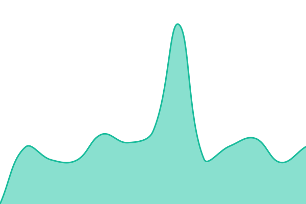
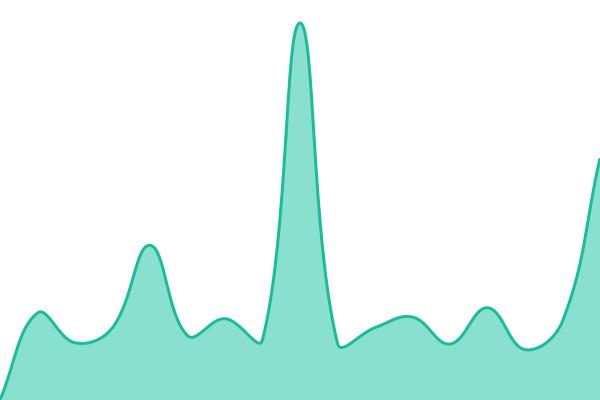
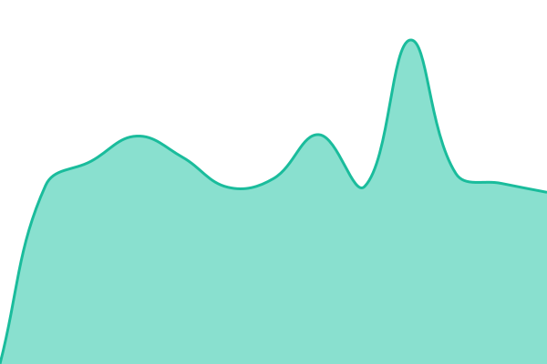
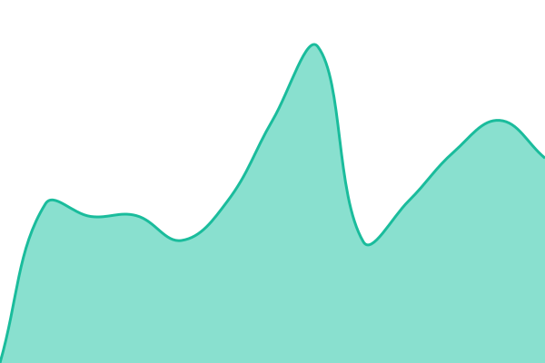
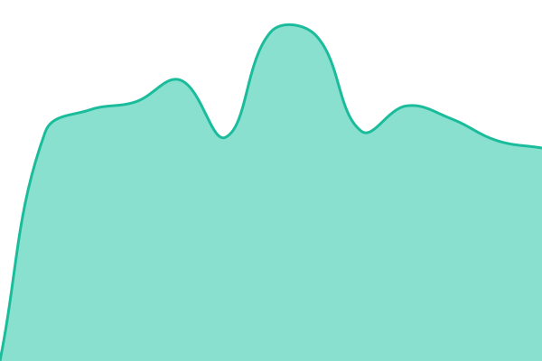
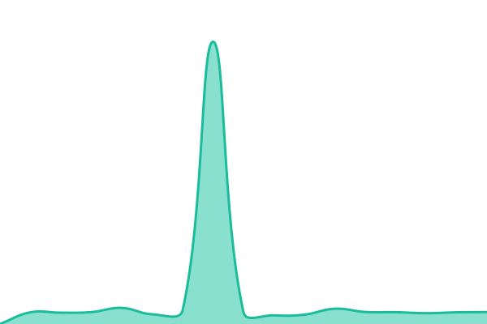
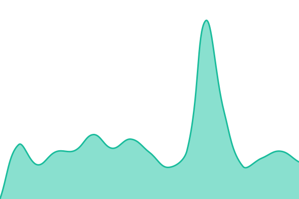

# 

This repository contains the uptime monitor and status page for [regimed.at](https://regimed.at/), powered by [Upptime](https://github.com/upptime/upptime).

<!--start: status pages-->
<!-- This summary is generated by Upptime (https://github.com/upptime/upptime) -->
<!-- Do not edit this manually, your changes will be overwritten -->
<!-- prettier-ignore -->
| URL | Status | History | Response Time | Uptime |
| --- | ------ | ------- | ------------- | ------ |
|  [CRM](https://crm.regimed.at) | 🟩 Up | [crm.yml](https://github.com/whytspace/regimed-status/commits/HEAD/history/crm.yml) | 

 1219ms
     
 | 

<a href="https://whytspace.github.io/regimed-status/history/crm">97.58%</a>
    

|  [Homepage](https://regimed.at) | 🟩 Up | [homepage.yml](https://github.com/whytspace/regimed-status/commits/HEAD/history/homepage.yml) | 

 856ms
     
 | 

<a href="https://whytspace.github.io/regimed-status/history/homepage">97.60%</a>
    

|  [/blog/2025-04-01-erste-hilfe-bei-grippe-und-erkaeltung](https://regimed.at/blog/2025-04-01-erste-hilfe-bei-grippe-und-erkaeltung) | 🟩 Up | [blog-2025-04-01-erste-hilfe-bei-grippe-und-erkaeltung.yml](https://github.com/whytspace/regimed-status/commits/HEAD/history/blog-2025-04-01-erste-hilfe-bei-grippe-und-erkaeltung.yml) | 

 382ms
     
 | 

<a href="https://whytspace.github.io/regimed-status/history/blog-2025-04-01-erste-hilfe-bei-grippe-und-erkaeltung">100.00%</a>
    

|  [/blog/2025-04-17-die-kraft-der-heilpflanzen](https://regimed.at/blog/2025-04-17-die-kraft-der-heilpflanzen) | 🟩 Up | [blog-2025-04-17-die-kraft-der-heilpflanzen.yml](https://github.com/whytspace/regimed-status/commits/HEAD/history/blog-2025-04-17-die-kraft-der-heilpflanzen.yml) | 

 286ms
     
 | 

<a href="https://whytspace.github.io/regimed-status/history/blog-2025-04-17-die-kraft-der-heilpflanzen">97.64%</a>
    

|  [/blog/2025-04-20-herz-kreislauf-gesundheit-im-fokus](https://regimed.at/blog/2025-04-20-herz-kreislauf-gesundheit-im-fokus) | 🟩 Up | [blog-2025-04-20-herz-kreislauf-gesundheit-im-fokus.yml](https://github.com/whytspace/regimed-status/commits/HEAD/history/blog-2025-04-20-herz-kreislauf-gesundheit-im-fokus.yml) | 

 371ms
     
 | 

<a href="https://whytspace.github.io/regimed-status/history/blog-2025-04-20-herz-kreislauf-gesundheit-im-fokus">97.66%</a>
    

|  [/blog/2025-05-10-gut-vorbereitet-in-den-urlaub](https://regimed.at/blog/2025-05-10-gut-vorbereitet-in-den-urlaub) | 🟩 Up | [blog-2025-05-10-gut-vorbereitet-in-den-urlaub.yml](https://github.com/whytspace/regimed-status/commits/HEAD/history/blog-2025-05-10-gut-vorbereitet-in-den-urlaub.yml) | 

 399ms
     
 | 

<a href="https://whytspace.github.io/regimed-status/history/blog-2025-05-10-gut-vorbereitet-in-den-urlaub">97.68%</a>
    

|  [/blog/2025-05-10-laborwerte-richtig-verstehen](https://regimed.at/blog/2025-05-10-laborwerte-richtig-verstehen) | 🟩 Up | [blog-2025-05-10-laborwerte-richtig-verstehen.yml](https://github.com/whytspace/regimed-status/commits/HEAD/history/blog-2025-05-10-laborwerte-richtig-verstehen.yml) | 

 387ms
     
 | 

<a href="https://whytspace.github.io/regimed-status/history/blog-2025-05-10-laborwerte-richtig-verstehen">97.70%</a>
    

|  [/demo-lindenplatz](https://regimed.at/demo-lindenplatz) | 🟩 Up | [demo-lindenplatz.yml](https://github.com/whytspace/regimed-status/commits/HEAD/history/demo-lindenplatz.yml) | 

 585ms
     
 | 

<a href="https://whytspace.github.io/regimed-status/history/demo-lindenplatz">97.71%</a>
    

|  [/demo-sanavita](https://regimed.at/demo-sanavita) | 🟩 Up | [demo-sanavita.yml](https://github.com/whytspace/regimed-status/commits/HEAD/history/demo-sanavita.yml) | 

 550ms
     
 | 

<a href="https://whytspace.github.io/regimed-status/history/demo-sanavita">97.73%</a>
    

|  [/dilux-laser](https://regimed.at/dilux-laser) | 🟩 Up | [dilux-laser.yml](https://github.com/whytspace/regimed-status/commits/HEAD/history/dilux-laser.yml) | 

 676ms
     
 | 

<a href="https://whytspace.github.io/regimed-status/history/dilux-laser">97.75%</a>
    

|  [/heschl-transporte](https://regimed.at/heschl-transporte) | 🟩 Up | [heschl-transporte.yml](https://github.com/whytspace/regimed-status/commits/HEAD/history/heschl-transporte.yml) | 

 643ms
     
 | 

<a href="https://whytspace.github.io/regimed-status/history/heschl-transporte">97.77%</a>
    

|  [/icecab-graz](https://regimed.at/icecab-graz) | 🟩 Up | [icecab-graz.yml](https://github.com/whytspace/regimed-status/commits/HEAD/history/icecab-graz.yml) | 

 440ms
     
 | 

<a href="https://whytspace.github.io/regimed-status/history/icecab-graz">97.79%</a>
    

|  [/impressum](https://regimed.at/impressum) | 🟩 Up | [impressum.yml](https://github.com/whytspace/regimed-status/commits/HEAD/history/impressum.yml) | 

 298ms
     
 | 

<a href="https://whytspace.github.io/regimed-status/history/impressum">97.81%</a>
    

|  [/vertrieb](https://regimed.at/vertrieb) | 🟩 Up | [vertrieb.yml](https://github.com/whytspace/regimed-status/commits/HEAD/history/vertrieb.yml) | 

 334ms
     
 | 

<a href="https://whytspace.github.io/regimed-status/history/vertrieb">97.83%</a>
    

<!--end: status pages-->

[**Visit our status website →**](https://whytspace.github.io/regimed-status)
